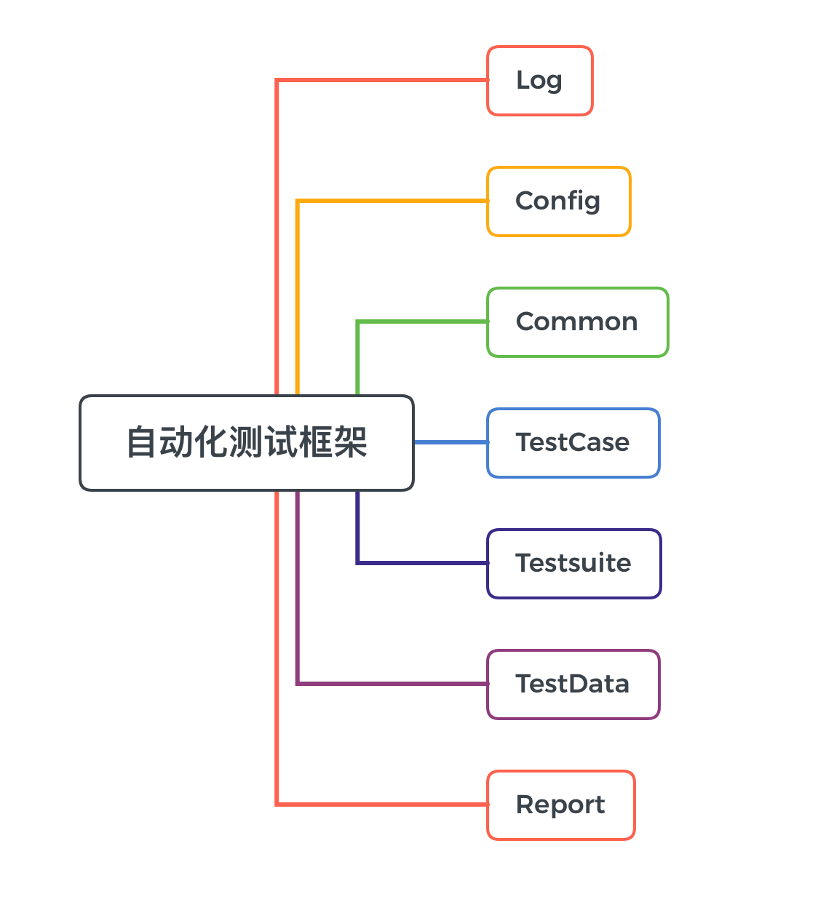

# 自动化测试框架

### 什么是自动化测试框架

自动化测试框架就是**为解决某些特定问题而约束边界，支撑整个问题解决方案，配套了一些解决问题的组件而构成的工具**。

```text
特定问题：什么问题？——自动化测试
约束边界：为什么约束？——明确测试范围和目的
解决方案：用什么方案解决问题？——编程语言+工具+其他
构成工具的组件：哪些组件？—— 用例、脚本、数据、日志、报告、通知
工具：特点是什么？—— 灵活性、可扩展性、高内聚低耦合
```

                                                                                                                  ------来自：老张[谈自动化测试框架](https://www.cnblogs.com/imyalost/p/9034194.html)

### 自动化测试框架的结构



Log：日志记录和管理功能，针对不同的情况，设置不同的日志级别，方便定位问题

Config：框架的配置文件、静态资源的管理，遵循高内聚低耦合原则

Common：公共函数、方法以及通用操作的管理，遵循高内聚低耦合原则

TestCase：测试用例管理功能，一个功能点对应一个或者多个case，尽可能的提高覆盖率

Testsuite：测试组件管理功能，针对不同场景不同需求，组装构建不同的测试框架，遵循框架的灵活性和扩展性

TestData：测试数据管理功能，数据与脚本分离，降低维护成本，提高可移植性

Report：测试报告生成和管理以及即时通知，测试结果快速响应

### 现在都有哪些自动化测试框架呢

关于python的自动化测试框架，包括不止本次项目所用到的Selenium+unittest。

还有以下部分使用度非常高的框架

1. \*\*\*\*[**Robot Framework**](https://robotframework.org/)\*\*\*\*

**Robot Framework**是一个通用的开源自动化框架，用于验收测试，验收测试驱动开发（ATDD）和机器人过程自动化（RPA）。它具有易于使用的表格测试数据语法，并使用关键字驱动的测试方法。它的测试功能可以通过使用Python或Java实现的测试库进行扩展，用户可以使用与创建测试用例相同的语法从现有的关键字创建新的更高级别的关键字。

    2. [**Pytest**](https://docs.pytest.org/en/latest/index.html)\*\*\*\*

pytest是一个成熟的全功能Python测试工具，可以帮助您编写更好的程序。

    3.[**Behave**](https://behave.readthedocs.io/en/latest/)\*\*\*\*

行为驱动开发（或BDD）是一种敏捷的软件开发技术，它鼓励开发人员，QA和软件项目中的非技术或业务参与者之间的协作。

    4.[**Lettuce**](http://lettuce.it/tutorial/simple.html)\*\*\*\*

Lerttuce是[BDD](http://en.wikipedia.org/wiki/Behavior_Driven_Development)（行为驱动开发）的一个非常有用和迷人的工具。它可以执行纯文本功能描述作为[Python](http://python.org/)项目的自动化测试，就像[Cucumber](http://cukes.info/)为 [Ruby做的那样](http://ruby-lang.org/)。

而本次讲到的Selenium+unittest是因为，本身unittest是python原生的一款单元测试框架，和Java里的Junit一样，unittest也称为pyunit。第二的原因就是基于原生的单元测试框架学习，会更容易如何做自动化测试，还有对python的测试会有更多的了解。在后面接触其他框架的时候，你会发现所有框架的原理都离不开unittest。所以，推荐使用elenium+unittest作为一款入门学习自动化的框架。

\*\*\*\*

